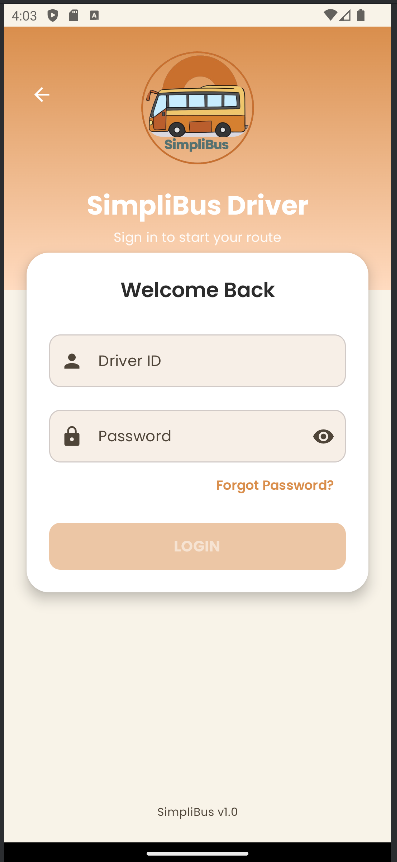
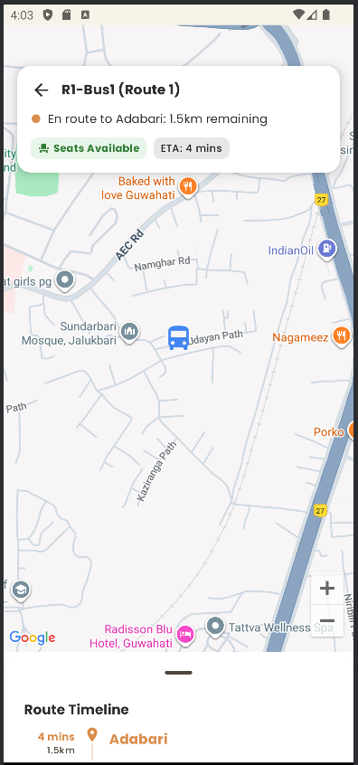
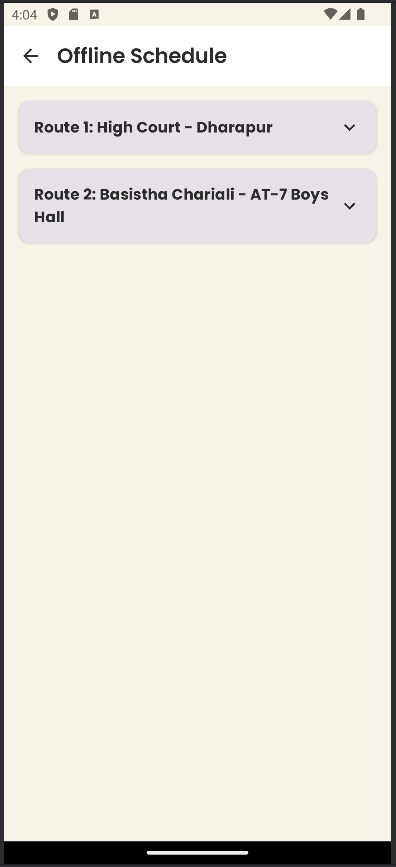

# 🚌 SimpliBus - Real-Time Campus Transit Tracking

**SimpliBus** is a modern, real-time bus tracking Android application designed to help students and commuters track university buses effortlessly. Built with **Kotlin & Jetpack Compose**, it features live map tracking, intelligent arrival notifications, and an offline schedule.

---

## 📱 Features

### 👤 Passenger App
* **📍 Real-Time Tracking:** Watch the bus move smoothly on the map with high-fidelity road geometry (snapped to roads, not straight lines).
* **🔔 Smart Notifications:** Get a "Bus Approaching" alert automatically when the bus is 1km away from your stop.
* **📅 Offline Schedule:** View detailed route timings and stop lists even without an internet connection.
* **🌗 Dynamic Theming:** Beautiful Light and Dark modes based on your system settings or manual toggle.
* **✨ Modern UI:** Floating status cards, timeline views, and smooth animations using Material 3.

### 🚍 Driver App
* **📡 Location Broadcasting:** Drivers broadcast their location in real-time with a single tap.
* **🔐 Secure Login:** Authentication system for authorized drivers only.
* **🛣️ Route Management:** Select specific routes (e.g., Route 1 vs. Route 2) to broadcast accurate data.

---

## 🛠️ Tech Stack

### Android (Frontend)
* **Language:** Kotlin
* **UI Framework:** Jetpack Compose (Material 3)
* **Maps:** Google Maps SDK for Android (with Compose extensions)
* **Architecture:** MVVM (Model-View-ViewModel)
* **Networking:** Retrofit & OkHttp
* **Real-Time:** Socket.IO Client
* **Concurrency:** Kotlin Coroutines & Flow

### Backend (Server)
* **Runtime:** Node.js
* **Framework:** Express.js
* **Real-Time Engine:** Socket.IO (WebSockets)
* **Geometry Logic:** Haversine distance calculations & OSRM (Open Source Routing Machine) integration for path snapping.

---

## 📸 Screenshots

  
  &nbsp;&nbsp;&nbsp;&nbsp;
  
  &nbsp;&nbsp;&nbsp;&nbsp;
  

| **Driver Login** | **Live Tracking** | **Offline Schedule** |
|:---:|:---:|:---:|
| Secure authentication with branded UI. | Real-time bus movement with high-fidelity pathing. | Expandable timeline for route planning. |
